# INTERCEPT

### One AI-native command center for your entire go-to-market.

You give it a website. A swarm of AI agents runs the whole motion for you — finding buyers, writing outbound, scanning competitors' ads, building your creative, simulating the conversation before you send, and reviving the deals you already lost. Everything they learn feeds one compounding brain, so the system gets sharper every run.

Built for the **YC AI Growth Hackathon**. Live demo: **https://intercept-two.vercel.app**

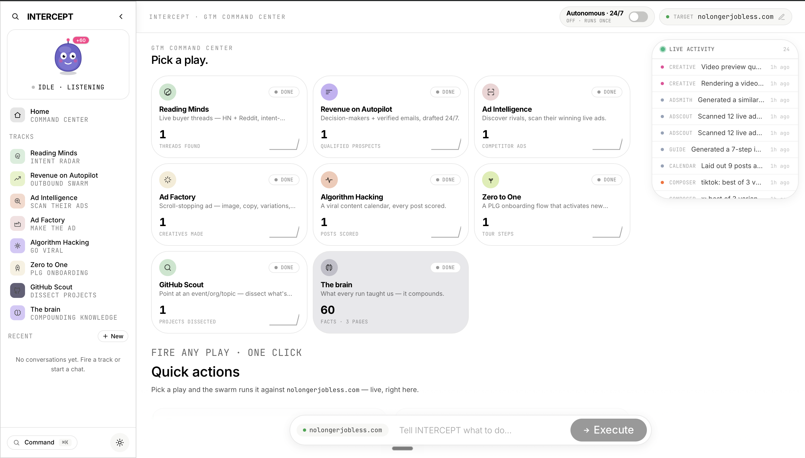

---

## The problem

Go-to-market is sold to you in pieces. One product for outbound. One for competitor research. One for ads. One for finding leads. One for onboarding. You end up paying for ten tools and stitching them together yourself — you're still the operator.

INTERCEPT is the opposite. It's a single command center where each of those pieces is a "play" the swarm runs against one target, and every play writes back into a shared brain. Point it at a company, pick a play (or fire all of them), and watch the work happen live.

---

## Table of contents

- [The product, page by page](#the-product-page-by-page)
- [Architecture](#architecture)
- [The agent swarm](#the-agent-swarm)
- [Sponsors and what they power](#sponsors-and-what-they-power)
- [Running it locally](#running-it-locally)
- [Project structure](#project-structure)
- [Deployment](#deployment)

---

## The product, page by page

### Command Center

The landing surface. Point INTERCEPT at a company, and the swarm starts working. Every play is a card with a live stat; the right rail is the real-time agent feed; the top-left mascot is **Blip**, a reactive copilot that nudges you toward the next move; and the **24/7** switch lets the agents keep running overnight.

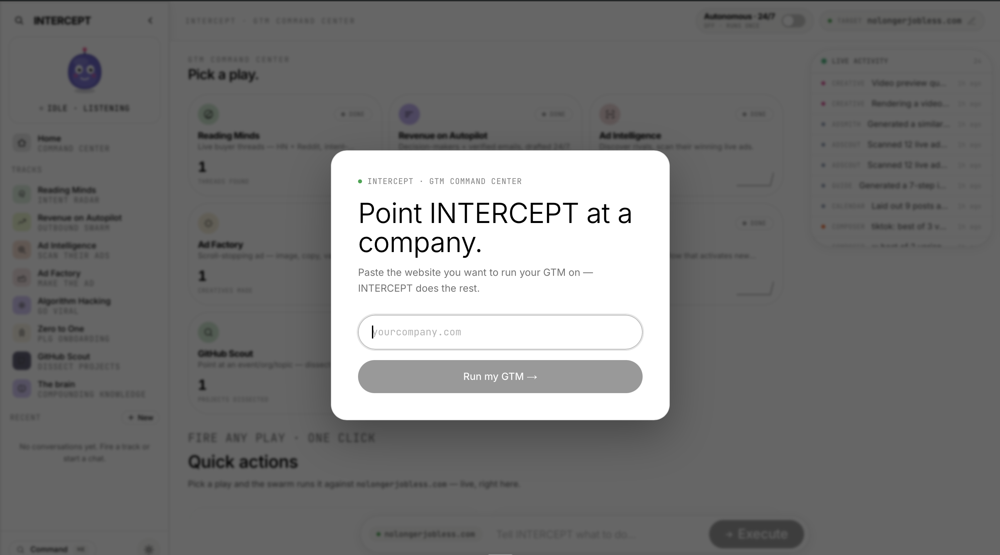

Pick a play, or type a free-form instruction into the command bar and the router figures out which agents to run.

### Reading Minds — intent radar

Instead of a static lead list, this finds **live buyer intent**: real conversations where people are describing the problem you solve, ranked by how close they are to buying. Threads are scored (frustrated, browsing) and the system can draft a reply for you to approve.

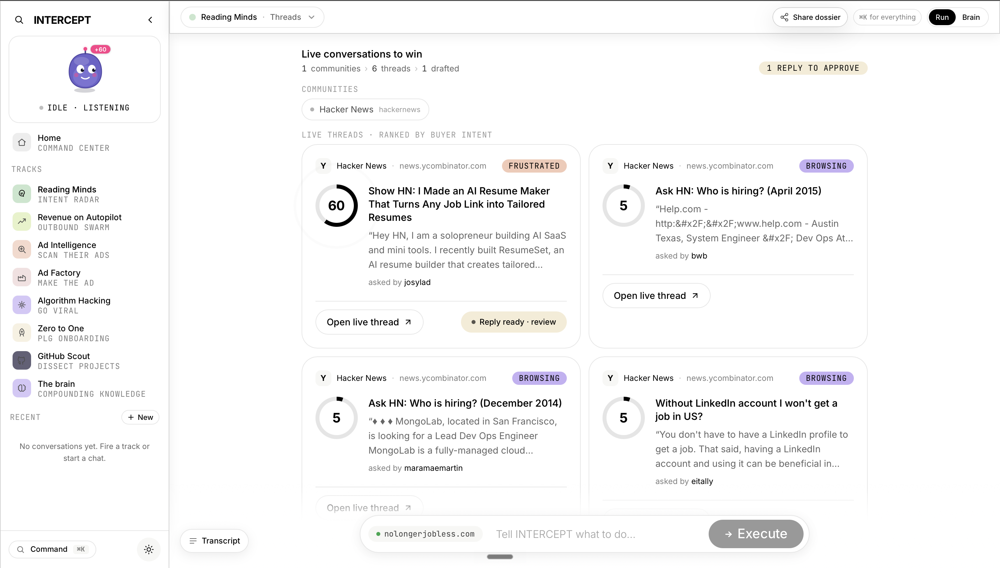

### Revenue on Autopilot — the outbound swarm

Your outbound SDR team as a pipeline of agents: an **Enricher** builds the ICP and positioning, a **Sourcer** finds companies and verified contacts, a **Qualifier** scores fit 0–100 and drops the misses, a **Writer** drafts signal-grounded emails, and a **Digital Twin** simulates the buyer's reply before you send. The board renders the whole funnel — sourced → qualified → drafted → sent.

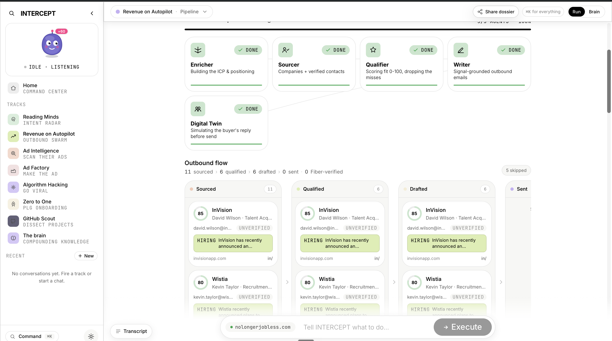

**Pitch Lab (the Digital Twin).** Before anything goes out, a simulated prospect reads each draft, predicts the reply, and scores it 0–100 — with the exact objections it expects and concrete suggestions to fix the draft.

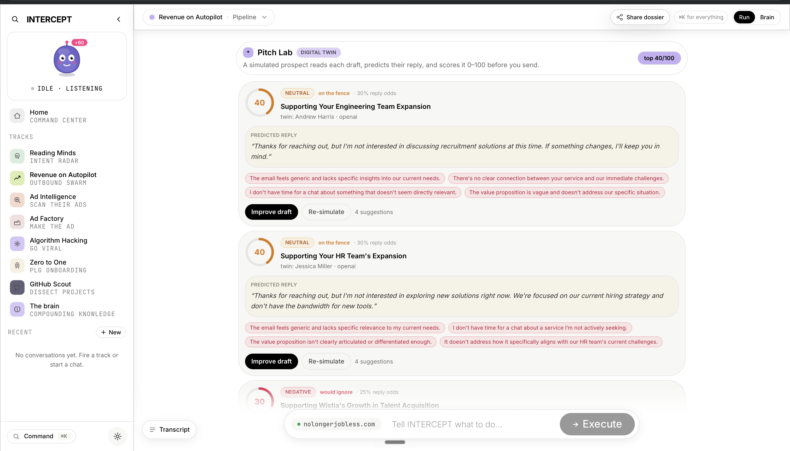

**Email Studio (Brew).** You don't send ugly plain text. Design the email — layout, accent, logo, tone, call to action — with a live preview, then send the branded version or a plain cold email. Save designs as templates.

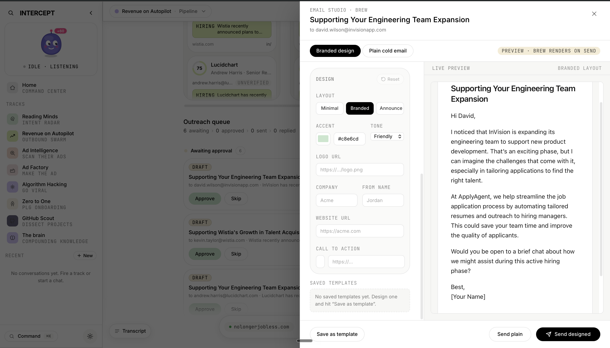

### Ad Intelligence — scan their ads

Discover a company's real competitors and pull the ads they're **actually running** across Meta, Google, and TikTok, scored and ranked by how long they've been live (a proxy for what's working). One click generates your own version of any winner.

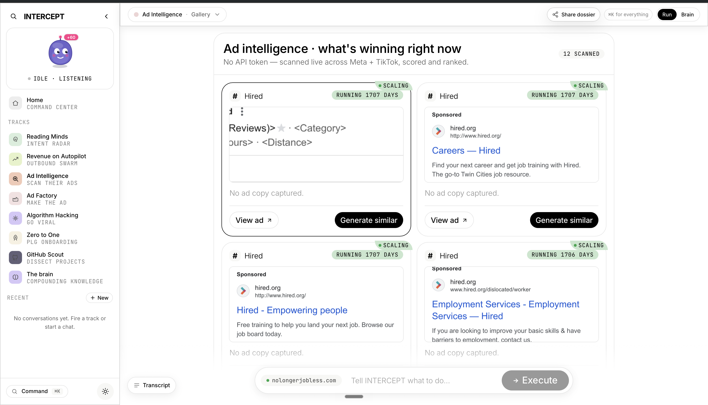

### Ad Factory — make the ad

Once INTERCEPT knows what's working, it builds your creative: a scroll-stopping image, the copy, and labeled variations (outcome-led, social-proof, and so on), each with a rationale for why it should win.

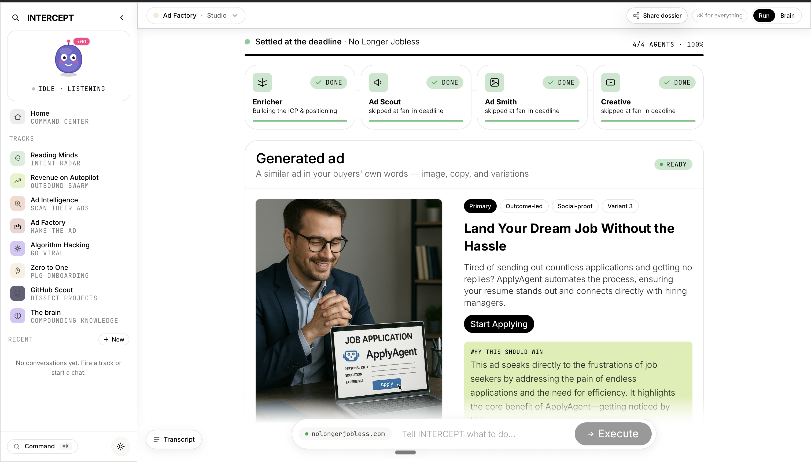

It also generates **video** — portrait (9:16) or landscape (16:9) — and degrades gracefully to a static frame if the chosen provider is unavailable. Paste a competitor's link or a viral post and it reverse-engineers the angles and hooks first.

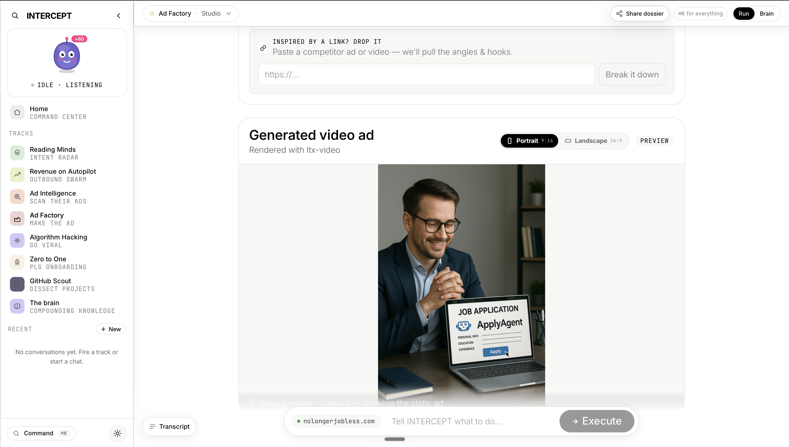

### Algorithm Hacking — go viral

Multiple post angles per platform, each scored by a virality model on hook, emotion, clarity, and timeliness — the winner is starred. It also produces a short-form vertical reel script and lays the scored posts across a two-week content calendar.

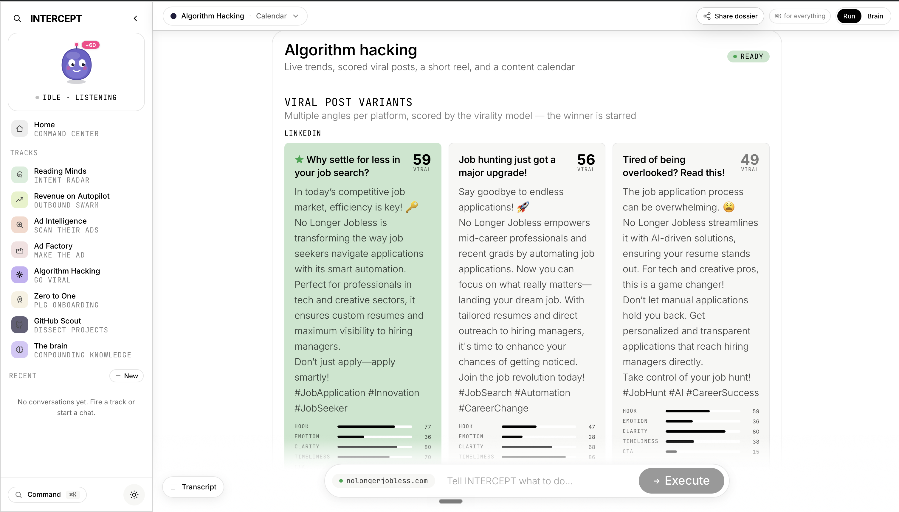

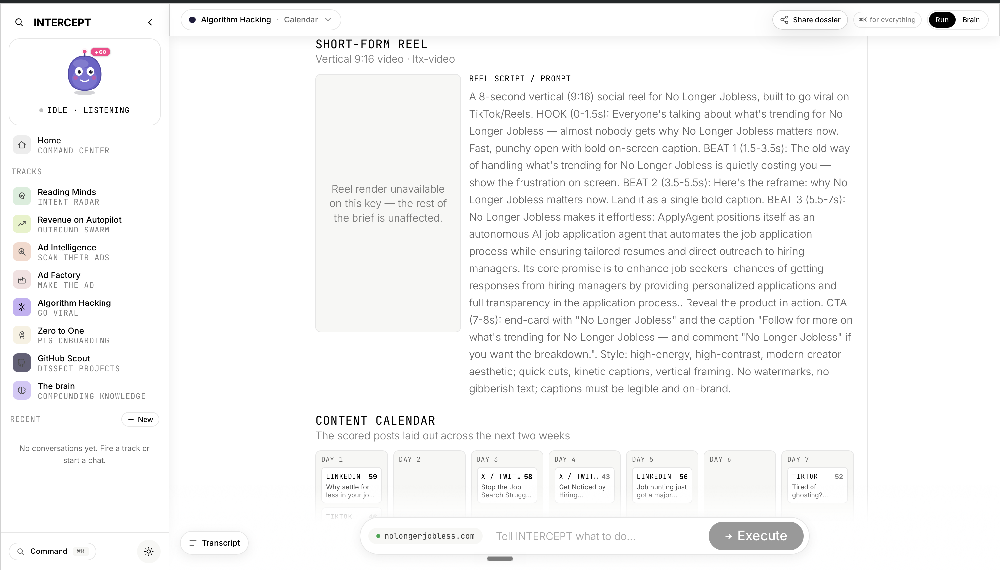

### Zero to One — PLG onboarding

Generates a first-run product tour and an activation checklist for the target's own product, with a paste-ready embed (Shepherd.js) you can drop straight into a site.

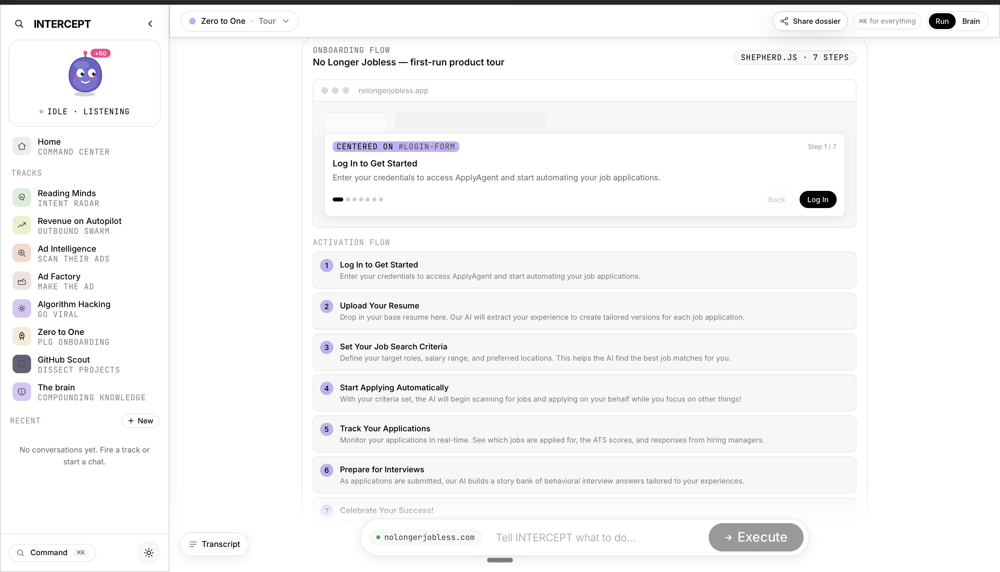

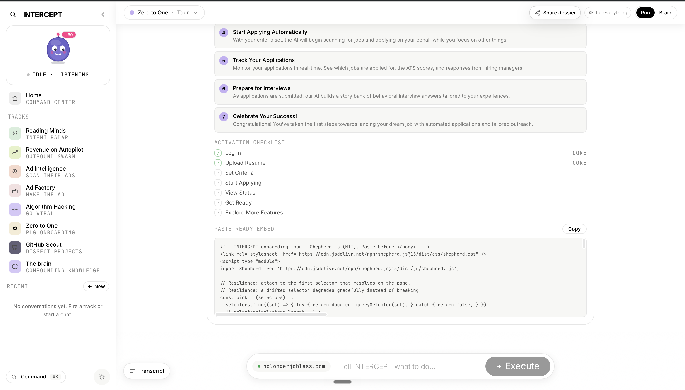

### GitHub Scout — dissect projects

Point it at a company, a hackathon, an org, or a topic. It searches public GitHub, enumerates the real repos, reads each one (README, manifest, contributors), and tells you what they're building, their stack, maturity, and how you'd sell to them. Public artifacts only — honest, with confidence and provenance on every row.

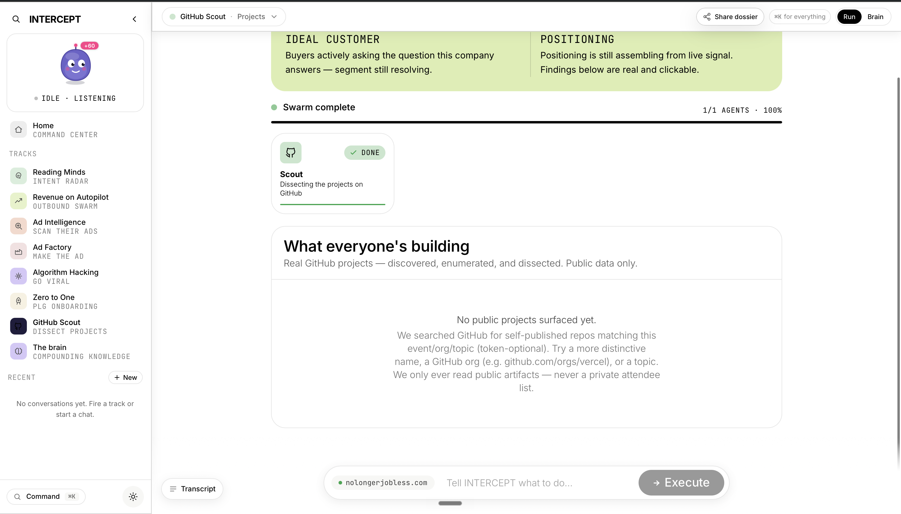

### The Brain — compounding knowledge

None of the agents work in isolation. Every run writes back into the Brain — an interactive knowledge graph of companies, competitors, buyer segments, and campaigns. It remembers, connects, and compounds run over run instead of starting from zero.

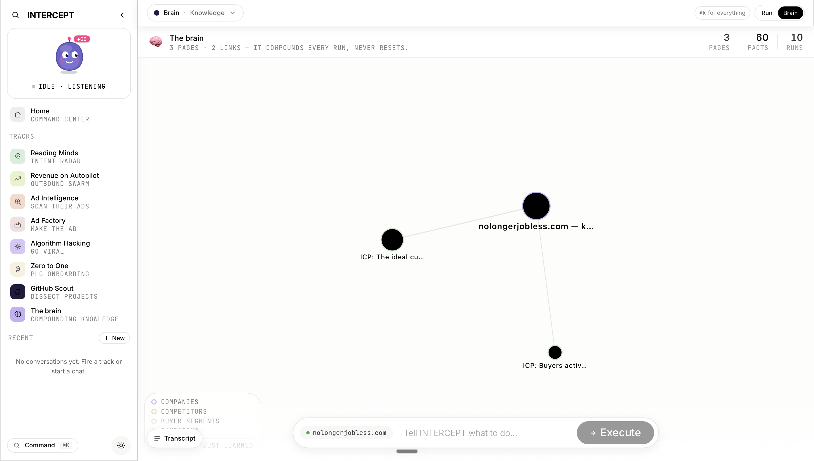

### Drive everything from the keyboard

A `⌘K` command palette fires any play, opens any board, or runs a free-form instruction.

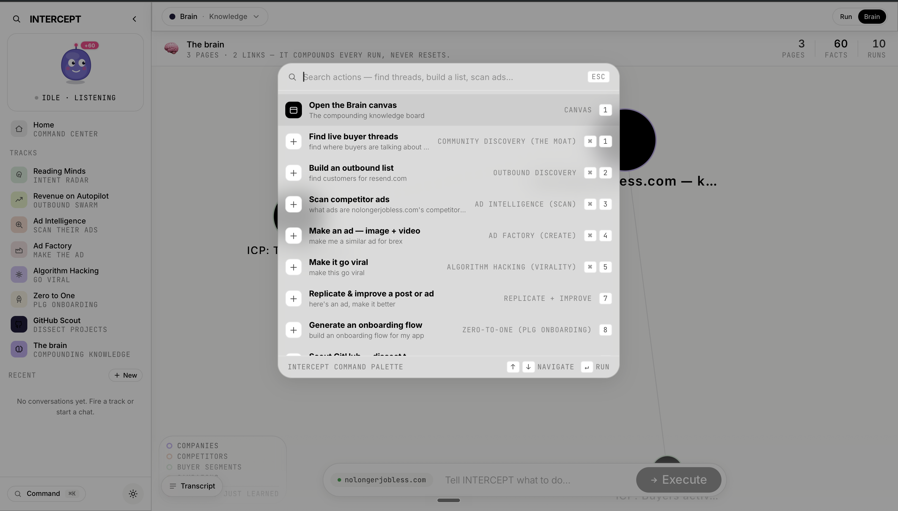

### Three more, built late

- **Conversation Simulator** — for any prospect, INTERCEPT plays out the full outbound conversation before you send: a personalized opener, the prospect's adaptive replies, a live intent meter, and a final score with a verdict (book the call, or pass).
- **Win-Back** — your CRM is full of deals that almost closed. INTERCEPT reads each lost deal, figures out *why* it died, then watches for the moment that reason dissolves (you shipped the feature, their champion got promoted, they raised) and surfaces who's ready to re-engage — with a transparent score: shipped it · they changed · still warm · looks re-won.
- **Hackathon Radar** — INTERCEPT turns its own engine on the competition: it pulls every project in the field, dissects each repo, and ranks itself against everyone — where it leads, where it lags, and which ideas to build next.

The **shareable Dossier** turns any run into a one-click intelligence report you'd actually send to a founder or investor.

---

## Architecture

INTERCEPT is a **Next.js 15** App Router frontend over a **Convex** backend. Convex is the real-time backbone: every agent, every run, and every live update you see in the UI is orchestrated there, and the React client subscribes to Convex queries so boards stream as the work happens. Secrets live in the Convex deployment environment, never in the bundle.

```
                          ┌─────────────────────────────────────────┐
   Next.js 15 (client)    │  Command Center · boards · Brain · Blip  │
   subscribes live  ◀─────│  (app/, components/)                     │
                          └───────────────┬─────────────────────────┘
                                          │ mutations / queries / actions
                          ┌───────────────▼─────────────────────────┐
   Convex (backend)       │  router → swarm → fan-in → persist        │
   real-time + storage    │  runs · threads · prospects · ads ·       │
                          │  posts · projects · knowledge (the Brain) │
                          └───────────────┬─────────────────────────┘
                                          │ graceful, fetch-based clients
        ┌──────────────┬─────────────────┼───────────────┬──────────────┐
   Orange Slice      Fiber          AgentMail        Supadata        OpenAI
   (enrich/source) (signal/reveal) (send/receive)  (scrape/video)  (reasoning)
        └─ Exa · Brew · Pexels · WaveSpeed / Veo / fal · GitHub · Meta · PostHog ─┘
```

**How a play runs.** A play is a `run` with an `intent`. The **router** resolves the canonical domain and classification first (phase 0). The orchestrator then fans out the relevant agents, each an `internalAction` that does its work and writes its board rows back to Convex. A fan-in deadline keeps a run honest — slow steps degrade to "partial" rather than hanging — and a short-lived `stepCache` shares common steps (like enrichment) across tracks so the same work isn't paid for twice. A dedupe layer reuses a recently completed `(intent, target)` run instead of redoing it.

**The compounding brain.** Each agent emits structured knowledge (ICP, competitors, buyer segments) that's written to a `knowledge` store and rendered as the Brain graph. Later runs read from it, so the system's answers sharpen over time instead of resetting.

**Graceful by contract.** Every external integration is written to degrade, never throw: no API key, a rate limit, an empty page, or a slow provider yields fewer or empty results and a labeled fallback — the run still completes. The video pipeline is provider-agnostic (WaveSpeed LTX → Veo → fal → a local Ken-Burns worker → a static frame), so any one available key produces a video and a missing one falls back cleanly.

---

## The agent swarm

Twenty specialized agents (`convex/agents/`), grouped by the surface they serve:

| Track | Agents |
|---|---|
| Routing | `router` (resolve domain + classify intent, phase 0) |
| Reading Minds | `detective`, `trendscout` (find and rank live intent) |
| Revenue on Autopilot | `enrich` (ICP/positioning), `sourcer` (companies + contacts), `qualifier` (fit 0–100), `writer` (drafts), `twin` (Digital Twin / Pitch Lab), `sender` (send), `reply` (inbound), `follower` (follow-ups) |
| Ad Intelligence | `adscout` (discover + scan competitor ads) |
| Ad Factory | `adsmith` (generate similar ads), `creative` (image + video), `reelmaker` (short-form reel) |
| Algorithm Hacking | `composer` (post variants), `calendar` (content calendar) |
| Zero to One | `guide` (onboarding tour + activation) |
| GitHub Scout | `scout` (discover + dissect repos) |
| Always-on | `watcher` (24/7 monitoring) |

---

## Sponsors and what they power

Everything below is wired to real, live services — not mocks.

| Sponsor | Powers | Code |
|---|---|---|
| **Convex** | The entire backend, real-time orchestration, storage | `convex/` |
| **Orange Slice** | Enrichment, company/person search, sourcing | `lib/orangeslice.ts` |
| **Fiber** | External buying signals + decision-maker contact reveal | `lib/fiber.ts` |
| **AgentMail** | Sending and receiving cold email | `lib/agentmail.ts` |
| **Supadata** | Web scraping + video transcripts (JS-rendered pages, link breakdown) | `lib/supadata.ts` |
| **Brew** | Designed, branded email rendering | `lib/brew.ts` |
| **Exa** | Community + web discovery | `lib/exa.ts` |
| **WaveSpeed / Veo / fal** | Video generation (provider-agnostic chain) | `lib/wavespeed.ts`, `lib/veo.ts`, `lib/videoWorker.ts` |
| **Pexels** | Stock visuals for creative | `lib/image.ts` |
| **Meta / ad scanning** | Competitor ad discovery across Meta + Google + TikTok | `lib/meta.ts`, `lib/adscan.ts` |
| **OpenAI / Gemini** | Reasoning, scoring, generation | `lib/openai.ts`, `lib/gemini.ts` |
| **PostHog** | Product analytics | `lib/posthog.ts` |

---

## Running it locally

**Prerequisites:** Node 18+ and a Convex account (`npx convex` handles the rest).

```bash
npm install
```

Set the keys on your Convex deployment (not in the bundle):

```bash
npx convex env set OPENAI_API_KEY      sk-...
npx convex env set ORANGESLICE_API_KEY ...
npx convex env set FIBER_API_KEY       ...
npx convex env set AGENTMAIL_API_KEY   ...
npx convex env set SUPADATA_API_KEY    ...
npx convex env set EXA_API_KEY         ...
npx convex env set BREW_API_KEY        ...
npx convex env set PEXELS_API_KEY      ...
# optional video: npx convex env set WAVESPEED_API_KEY / FAL_KEY
```

`NEXT_PUBLIC_CONVEX_URL` and the PostHog public keys go in `.env.local` (gitignored). Then run the three processes, each in its own terminal:

```bash
npx convex dev        # the backend + function watcher (deploys on save)
npm run dev           # the Next.js app on http://localhost:3000
npm run video-worker  # optional local video worker on :8787
```

Seed demo data with `npm run seed`. Type-check with `npm run typecheck`.

---

## Project structure

```
app/                  Next.js App Router (the Command Center, dossier route, /api/brain)
components/           UI — boards, the sidebar, Blip, the panels for each track
convex/               Backend: schema, run orchestration, settings, the agents
  agents/             The 20 swarm agents (one internalAction each)
lib/                  Fetch-based integration clients (one per sponsor) + the contract
scripts/              The video worker + the demo seeder
docs/screenshots/     The images used in this README
```

The `contract` (`lib/contract.ts`) is the shared source of truth for capabilities, the agent roster, and the run/router types — so the client compiles independently of the backend deploy order.

---

## Deployment

The backend deploys to Convex (`npx convex deploy`); the frontend is a standard Next.js app on Vercel with `NEXT_PUBLIC_CONVEX_URL` pointed at the production Convex deployment. The video worker is optional in production — without it, the provider-agnostic chain (or a static frame) takes over.

---

*Built fast, for the YC AI Growth Hackathon. Real data, real agents, one command center.*
